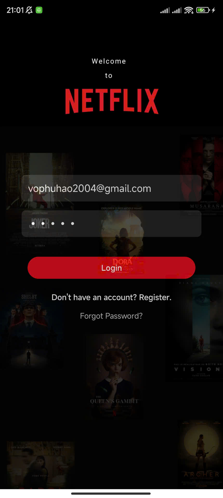
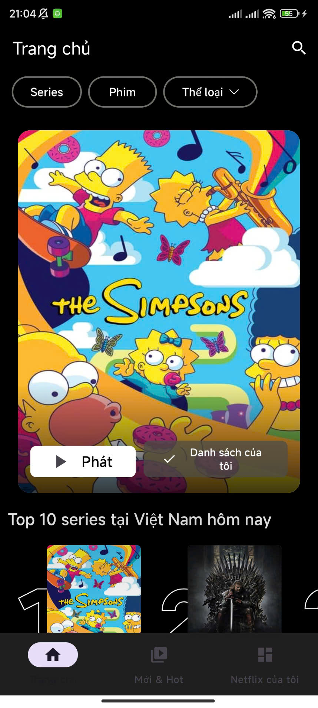
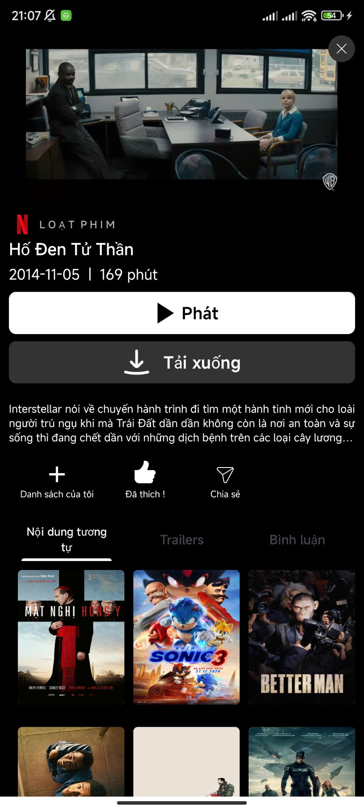
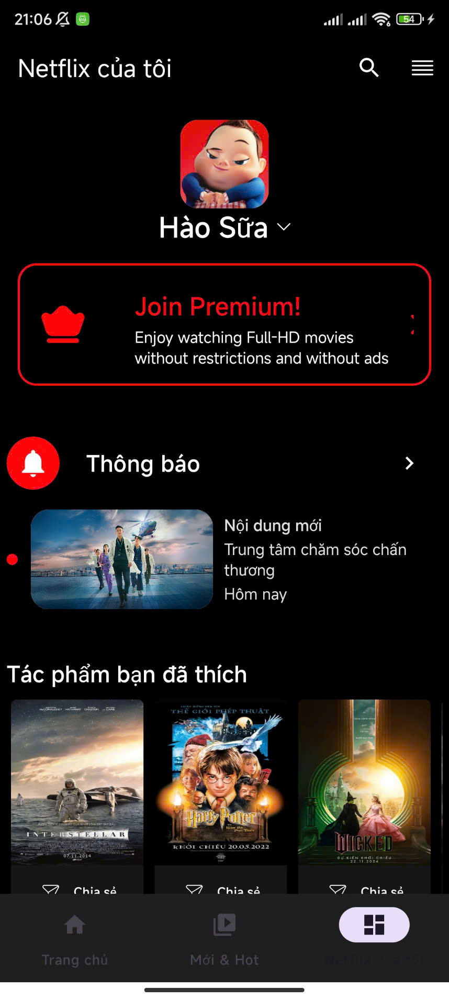

# 🎬 Netflix Clone - Android App (Java + XML)

Đây là ứng dụng xem phim trên nền tảng Android được xây dựng bằng Java và XML. Ứng dụng kết nối với backend (Spring Boot + MySQL) thông qua REST API để hiển thị danh sách phim, chi tiết phim, xem video, lưu yêu thích và gợi ý phim.

---

## 🚀 Tính năng chính

- 📺 Xem danh sách phim và TV series từ server
- 🔍 Tìm kiếm phim theo tên
- ❤️ Lưu phim yêu thích
- ⏯️ Ghi nhớ thời gian xem dở
- 🔔 "Nhắc tôi" khi phim ra mắt
- 💬 Bình luận cho từng phim
- 🤖 Gợi ý phim dựa vào hành vi người dùng
- 🔐 Đăng nhập / Đăng ký

---

## 🛠️ Công nghệ sử dụng

- **Ngôn ngữ**: Java
- **Giao diện**: XML Layout
- **Gọi API**: Retrofit2
- **Xử lý JSON**: Gson
- **Quản lý hình ảnh**: Glide / Picasso
- **Xác thực**: JWT token / SharedPreferences
- **Player**: ExoPlayer (nếu có phát video)

---

## 🖼️ Giao diện ứng dụng
### Login
<p align="center">
  
</p>

### Trang chủ
<p align="center">
  
</p>

### Chi tiết phim
<p align="center">
  
</p>

### Hồ sơ
<p align="center">
  
</p>


## 📲 Cài đặt và chạy ứng dụng

### 1. Clone dự án

```bash
git clone https://github.com/TienDat1679/Netflix-Clone-Android.git

### 2. Chạy dự án

--Import dự án vào Android Studio sau đó khởi động dự án bằng máy ảo

**Thêm phần liên hệ / đóng góp / license**

```markdown
## 🤝 Đóng góp

Chúng tôi luôn chào đón các đóng góp để hoàn thiện dự án hơn. Hãy fork repo, tạo nhánh mới và gửi pull request!

## 📜 License

Dự án được phát triển cho mục đích học tập, phi thương mại.

